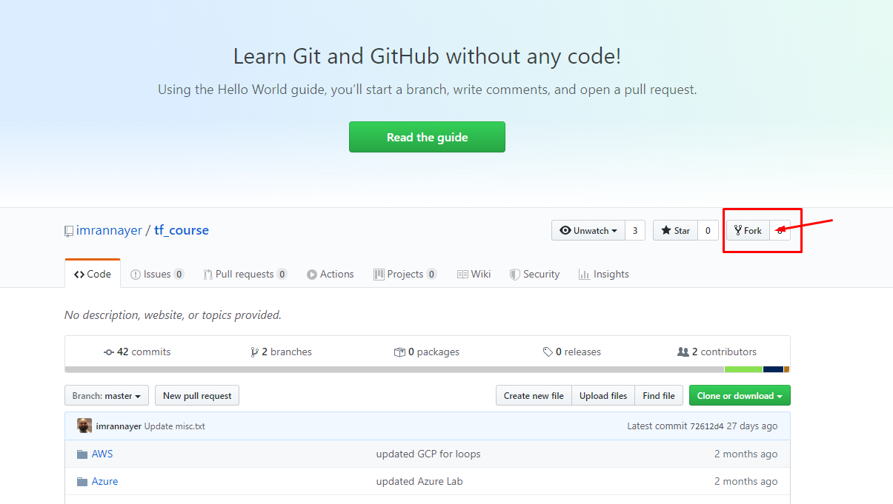
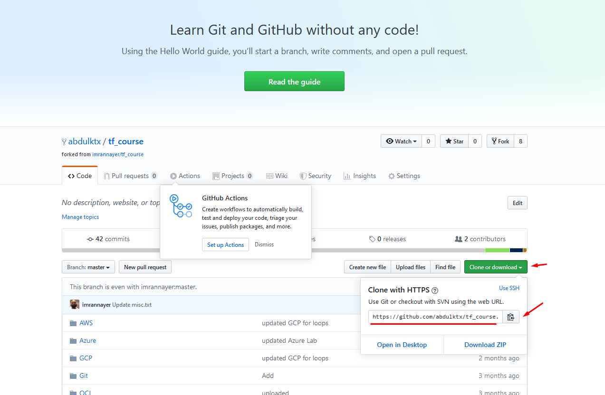

# LAB # 1 - Clone/Create Repo


### There are multiple ways to create repositories, for this exercise we will cover two methods.

- Fork repo from source repo
- Work with your course repo

## Fork repo from source repo

- Login to github.com with your account
- open URL: https://github.com/imrannayer/tf_course repo
- Click the "Fork" button to clone repo into your github account.



## Cloning

- Copy url for your repo from your github account



- Clone course repository and rename it
```bash
git clone https://github.com/your-github-user/tf_course.git
```


- Add empty file/directory 
```bash
cd tf_course
mkdir my_test_code
cd my_test_code
echo "This is random # $RANDOM" > my_random_code.txt
git status
```

- Commit your change for your local repo *(change location if you are not using home directory)*
```bash
cd ~/tf_course
git add my_test_code
git commit -m "My first change" 
```

